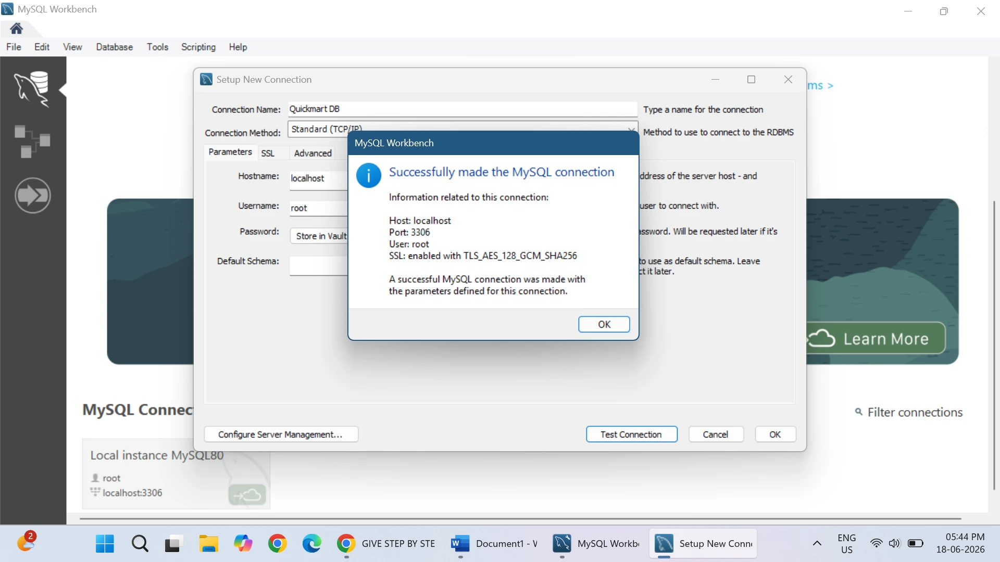

# 🛒 Retail Store Sales Analysis using SQL

## 📌 Project Overview

This project demonstrates SQL-based data analysis on a retail store database using MySQL. The project includes database creation, table creation, data insertion, and various SQL queries to analyze sales, customers, products, and revenue.

---

## 🗄️ Database Name

**quickmart_db**

---

## 📂 Tables Used

- customers
- categories
- products
- orders
- order_items

---

## 🛠️ SQL Concepts Covered

- Database Creation
- Table Creation
- Primary Key & Foreign Key
- INSERT INTO
- SELECT
- WHERE
- ORDER BY
- GROUP BY
- HAVING
- Aggregate Functions
- INNER JOIN
- LEFT JOIN
- Subqueries
- CASE WHEN
- Date Functions
- Window Functions
- RANK()
- PARTITION BY

---

## 📁 Project Files

- 📄 Retail_Store_Sales_Analysis.sql
- 📂 Screenshots
- 📘 README.md

---

# 📸 Project Screenshots

## 1️⃣ MySQL Connection

---

## 2️⃣ Database Created

---

## 3️⃣ Tables Created

---

## 4️⃣ Customer Data Verification

---

## 5️⃣ Orders Data Verification

---

## 6️⃣ Order Items Verification

---

## 7️⃣ Sample Query Output (INNER JOIN)

---

## 8️⃣ Sample Query Output (CASE WHEN)

---

## 9️⃣ Sample Query Output (Window Function)

---

## 🚀 How to Run

1. Open MySQL Workbench.
2. Create or select the `quickmart_db` database.
3. Open `Retail_Store_Sales_Analysis.sql`.
4. Execute the script.
5. Run the analytical queries to view the results.

---

## 👩‍💻 Author

**Tanishka Salvi**

---

⭐ Thank you for visiting this repository!
